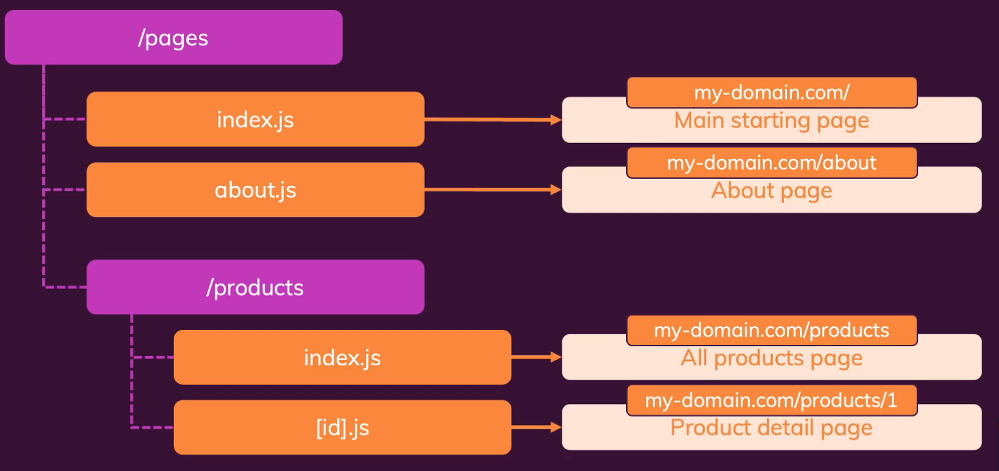
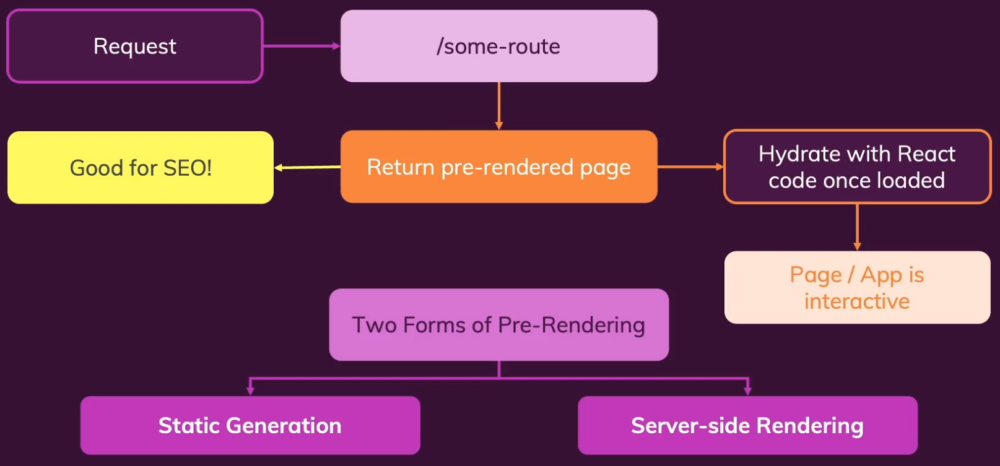
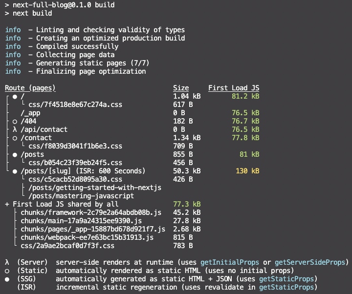

## About The Project

- Next.js & React - The Complete Guide (incl. Two Paths!)
- Learn NextJS from the ground up and build production-ready, fullstack ReactJS apps with the NextJS framework!
- [GitHub - nextjs-course-code](https://github.com/mschwarzmueller/nextjs-course-code)
- [Maximilian Schwarzmüller](https://github.com/maxschwarzmueller)
- [Academind](https://academind.com/)

&nbsp;

---

&nbsp;

## Why NextJS

- The React Framework for Production
- **Key Features:**
  - **Server-Side Rendering (SSR)**
    - Automatic page pre-rendering: Great for SEO and initial load
    - Blending client-side and server-side: Fetch data on the server and render finished pages
  - **File-Based Routing**
    - Define pages and routes with files and folders instead of code
    - Less code, less work, highly understandable
  - **Fullstack Capabilities**
    - Easily add backend (server-side) code to your Next/ React apps
    - Storing data, getting data, authentication etc. can be added to your React projects

&nbsp;

---

&nbsp;

## Course Outline

- **Basic & Foundation** (Introducing key features)
  - File-Based Routing
  - Page Pre-Rendering & Data Fetching
  - Combining "Standard Rect" & NextJS
  - API Routes & Fullstack Capabilities
- **Advanced Concepts** (Building for production)
  - Optimization Opportunities
  - Looking Behind the Scenes & Theory
  - Deployment & Configuration
  - Authentication
- **Summaries & Refreshers** (Optimizing your time)
  - ReactJS Refresher
  - NextJS Summary

&nbsp;

---

&nbsp;

## Setup

- `npx create-next-app`
- Parsing error : Cannot find module 'next/babel' -> `.eslintrc.json` -> `"extends": ["next/babel","next/core-web-vitals"]`
- `next dev`

&nbsp;

---

&nbsp;

## Basic & Foundation

### File-Based Routing



&nbsp;

### Page Pre-Rendering & Data Fetching



- **Static Site Generation (SSG)**
  - Pre-generation a page (with data prepared on the server-side) during build time
  - Pages are prepared ahead to time and can be cached by the server/ CDN serving the app
  - `export async function getStaticProps(context){...}`
- **Incremental Static Regeneration (ISR)**
  - Pre-generate Page
  - Re-generate it on every request, at most every X seconds
    - Serve "old" page if re-generation is not needed yet
    - Generate, store and serve "new" page otherwise
  - `export async function getStaticPaths(){...}`

&nbsp;

### Combining "Standard Rect" & NextJS

- **Server Side Rendering (SSR)**
  - Pre-render for every request
  - Need to access to the request object (e.g. cookies)
  - `export async function getServerSideProps(){...}`
- **Client-Side Data Fetching**
  - Data that doesn't require pre-rendering
    - Data changing with high frequency (e.g. stock data)
    - User specific data (e.g. last orders in an online shop)
    - Partial data (e.g. data that's only used on a part of an page)
  - Pre-fetching the data for page generation might not work or be required
    - "Traditional" client-side data fetching (e.g. `useEffect()` with `fetch()` is fine)
  - `npm i swr` ([SWR - React Hooks for Data Fetching](https://swr.vercel.app/))

&nbsp;

### API Routes & Fullstack Capabilities

- Store server side code in `./pages/api`
- Using NodeJS features in `api` folder

&nbsp;

---

&nbsp;

## Advanced Concepts

### Optimization Opportunities

- Adding meta and <head> tags
- Re-using components, logic & configuration
- Optimizing images

&nbsp;

### Deployment & Configuration

- **Standard Build:**
  - `next build`
  - Produces optimized production bundles and a server-side app (Requires NodeJS server)
  - Pages are pre-rendered (if possible) but NodeJS server is required for API routes, server-side pages and pager revalidation
  - Re-deploy needed if code changes or you don't use revalidation and need page updates
- **Full Static Build:**
  - `next export`
  - Produces 100% static app (HTML, CSS & JS), hence NodeJS server is not required
  - Doesn't work if your app uses API routes, server-side pages or wants to use page revalidation
  - re-deploy needed for all code and content changes
  - [Understanding static HTML export in Next.js](https://blog.logrocket.com/understanding-static-html-export-next-js/)
- **Deployment Steps:**
  1. Add page metadata, optimize code, remove unnecessary dependencies
  2. Use environment variables for variable data (e.g. database credentials, API keys, ...)
  3. Do a test build and test the production-ready app locally or on some test server
  4. Deploy



&nbsp;

---

&nbsp;

## next-events-app

### Planning The Project Routes

|        Path         |         Page         |       Remarks        |
| :-----------------: | :------------------: | :------------------: |
|         `/`         |     Landing Page     | Show featured event  |
|      `/events`      |     Events Page      |   Show all events    |
| `/events/<some-id>` |  Event Details Page  | Show selected event  |
|  `/events/...slug`  | Filtered Events Page | Show filtered events |

- [Firebase](https://console.firebase.google.com)
  - Create Project
  - Create Realtime Database in test mode
  - Import `dummy-data.json`

&nbsp;

---

&nbsp;

## next-full-blog

- `npm i react-markdown`
- `npm i gray-matter`
- `npm i react-syntax-highlighter`
- `npm i mongodb`

&nbsp;

---

&nbsp;

## next-basic-auth

- [NextAuth](https://next-auth.js.org/)
- `npm i next-auth`
- `npm i mongodb`
- `npm i bcryptjs`

&nbsp;

---

&nbsp;

> In a Next.js application, the separation of server-side and client-side code is not as distinct as it might be in other frameworks, since Next.js utilizes a hybrid approach. However, there are some key folders and conventions that can help you identify the primary roles of different parts of the application.
>
> - **`pages` folder:** This folder contains the main components of your application that are responsible for rendering pages. Next.js uses server-side rendering (SSR) by default for components in this folder, but you can also choose to render them client-side or statically.
> - **`public` folder:** This folder is used for serving static assets like images, stylesheets, or scripts that are directly accessible by the client. Files placed in the public folder will be served at the root path, making them accessible from the browser without the need for server-side code.
> - **`components` folder:** This folder, although not created by default, is commonly used to store reusable React components that are mostly client-side. However, these components can also be used in server-rendered pages or APIs.
> - **`lib` or `utils` folder:** This is another optional folder that developers typically use to store utility functions or shared libraries. The code here can be used on both the server and the client, depending on your application's requirements.
> - **`api` folder (inside pages):** This is where you would place server-side API routes. By creating files in the pages/api folder, you can create serverless functions that run on the server-side and can be called from the client-side as an API endpoint.
>
> When you're using shared folders in a Next.js application, such as the lib or utils folders, the code within them can be used both on the server-side and the client-side, depending on the context in which they are imported.
>
> Next.js uses a bundler (Webpack, by default) to handle module imports and bundle your application. The bundler is intelligent enough to only include the necessary parts of the shared code in the client-side bundle if they are actually used in the client-side components.
>
> For example, if you have a utility function in a shared folder that is only used in server-side code (e.g., API routes), it will not be included in the client-side bundle. Similarly, if another utility function is used in both server-side and client-side code, the bundler will include it in the client-side bundle.
>
> This means that shared folders' code will only be bundled and sent to the browser if they are used in client-side components or pages. Next.js handles this process efficiently, ensuring that only the necessary code is included in the client-side bundle to minimize its size and optimize loading times.
>
> In summary, shared folders' code is only included in the client-side bundle if it's actually used in the client-side parts of your application. The bundler takes care of optimizing the inclusion of shared code between server and client, ensuring optimal performance.
>
> To prove that shared code is only included in the client-side bundle when it's used in client-side components or pages, you can perform a simple experiment in a Next.js application. Follow these steps:

```sh
# Create a new Next.js application using create-next-app:
npx create-next-app your-app-name
cd your-app-name

# Create a lib folder in the project root directory and add two files with utility functions:
mkdir lib
touch lib/usedByClient.js
touch lib/usedByServer.js

# Create file for `usedByServer` function
touch pages/api/helloServer.js
```

```js
// Add some simple utility functions to the files you created:
// `lib/usedByClient.js`
export function usedByClient() {
  console.log('This function is used by the client.');
}

// lib/usedByServer.js
export function usedByServer() {
  console.log('This function is used by the server.');
}

// Use the `usedByClient` function in a client-side component or page, such as the `index.js` file in the `pages` folder:
import { usedByClient } from '../lib/usedByClient';

export default function Home() {
  usedByClient();

  return (
    <div>
      <h1>Hello Next.js</h1>
    </div>
  );
}

// Use the `usedByServer` function in a server-side API route:
import { usedByServer } from "../../lib/usedByServer";

export default function handler(req, res) {
  usedByServer();
  res.status(200).json({ text: "Hello from the server-side API route" });
}
```

```sh
#  Analyze the client-side bundle:
npm run build
npm run analyze
```

> This will create a production build of your application and generate an interactive visualization of your bundle.
>
> Inspect the bundle:
>
> Look for the lib/usedByClient.js and lib/usedByServer.js files in the interactive visualization. You will notice that only the lib/usedByClient.js file is included in the client-side bundle, proving that only the code used on the client-side is included in the bundle.
>
> By following these steps, you can demonstrate that Next.js intelligently includes only the necessary parts of shared code in the client-side bundle.

&nbsp;

---

&nbsp;
